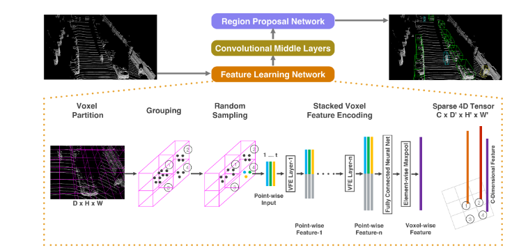
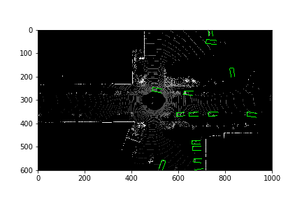
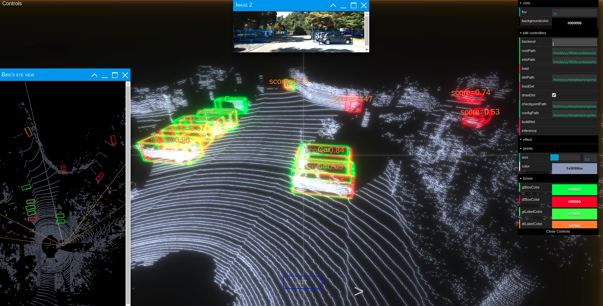
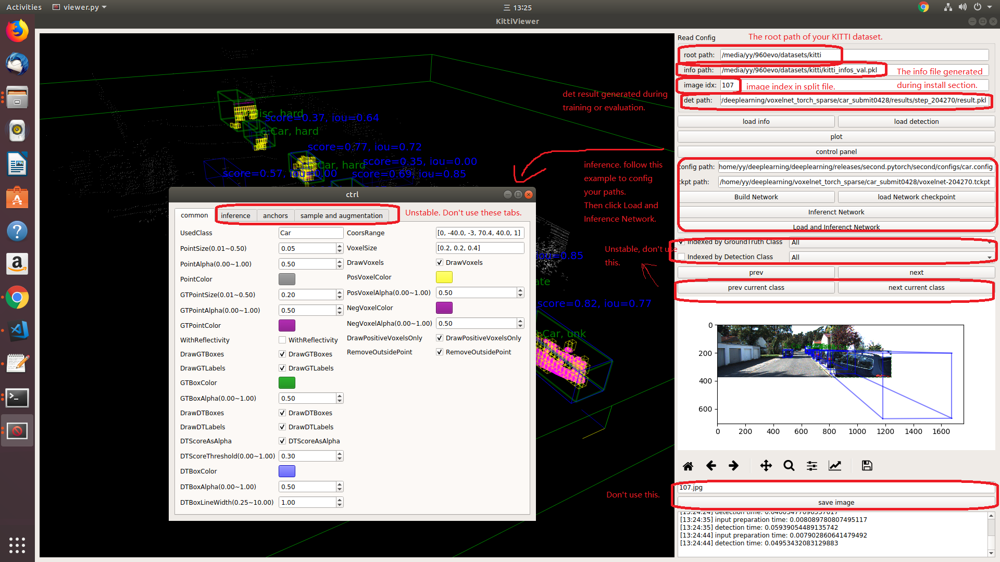
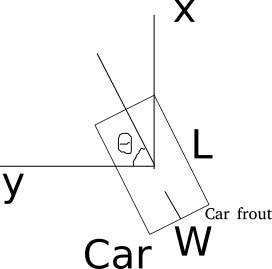

# VoxelNet: End-to-End Learning for Point Cloud Based 3D Object Detection

## 1 简介
  
本项目基于PaddlePaddle框架复现了基于体素的3D目标检测算法VoxelNet，在KITTI据集上进行了实验。
项目提供预训练模型和AiStudio在线体验NoteBook。

**论文：**
- [1] Yin Zhou, Oncel Tuzel.
Proceedings of the IEEE Conference on Computer Vision and Pattern Recognition (CVPR), 2018. [VoxelNet: End-to-End Learning for Point Cloud Based 3D Object Detection](https://arxiv.org/abs/1711.06396)

**项目参考：**
- [https://github.com/qianguih/voxelnet](https://github.com/qianguih/voxelnet)
- [https://github.com/traveller59/second.pytorch](https://github.com/traveller59/second.pytorch)

由于该论文并未提供开源的代码，目前也找不到能够复现其论文中指标的项目。
因此本项目参考了现有复现项目（voxelnet-tensorflow）和该论文后续的算法改进版本（second）进行了复现，超过了现有复现中最优的指标水平,接近论文指标。

## 2 复现精度
>在KITTI val数据集（50/50 split as paper）的测试效果如下表。

|NetWork |epochs|opt|lr|batch_size|dataset|memory|card|
| :---: | :---: | :---: | :---: | :---: | :---: | :---: | :---: |
|VoxelNet|160|SGD|0.002|2|KITTI|16G|1|

```
Car AP@0.70, 0.70, 0.70:
bbox AP:88.95, 78.93, 77.26
bev  AP:89.06, 79.08, 77.82
3d   AP:78.21, 63.72, 56.60
aos  AP:43.70, 39.11, 37.70
Car AP@0.70, 0.50, 0.50:
bbox AP:88.95, 78.93, 77.26
bev  AP:90.52, 88.58, 87.35
3d   AP:90.35, 87.57, 86.29
aos  AP:43.70, 39.11, 37.70

Car coco AP@0.50:0.05:0.95:
bbox AP:65.77, 59.51, 57.18
bev  AP:65.98, 61.36, 58.41
3d   AP:52.82, 46.07, 43.27
aos  AP:33.11, 29.14, 27.63
```
注意：项目的网络结构和损失函数以及大部分数据处理、训练配置和原文一致。不同之处在于cls loss和loc loss的权重分配和batch size不同。另外，论文中没提及的细节，本项目均参考Second项目的实施。

## 3 开始

### 1. 克隆项目

```bash
git clone https://github.com/CuberrChen/VoxelNet.git
```

### 2. 安装依赖
- **python版本**：3.7.4
- **PaddlePaddle框架版本**：2.2.1
- **CUDA 版本**： NVIDIA-SMI 450.51.06    Driver Version: 450.51.06    CUDA Version: **11.0**   cuDNN:7.6

**由于PaddlePaddle/cuDNN本身的BUG，CUDA 10.1版本当batch size > 2时会报如下错误**：
```
OSError: (External) CUDNN error(7), CUDNN_STATUS_MAPPING_ERROR. 
  [Hint: 'CUDNN_STATUS_MAPPING_ERROR'.  An access to GPU memory space failed, which is usually caused by a failure to bind a texture.  To correct, prior to the function call, unbind any previously bound textures.  Otherwise, this may indicate an internal error/bug in the library.  ] (at /paddle/paddle/fluid/operators/conv_cudnn_op.cu:758)

```

因此单卡**如果环境不是CUDA 11.0以上，config文件中batch size设置为2即可，后续通过训练的accum_step参数开启梯度累加起到增大bs的效果**。设置accum_step=8即表示bs=16，相应config文件的初始学习率调整为0.01左右。
It is recommend to use Anaconda package manager.

```bash
cd VoxelNet/
pip install -r requirements.txt
```

### 3. 为numba设置cuda环境

you need to add following environment variable for numba.cuda, you can add them to ~/.bashrc:

```bash
export NUMBAPRO_CUDA_DRIVER=/usr/lib/x86_64-linux-gnu/libcuda.so
export NUMBAPRO_NVVM=/usr/local/cuda/nvvm/lib64/libnvvm.so
export NUMBAPRO_LIBDEVICE=/usr/local/cuda/nvvm/libdevice
```

### 4. 将项目VoxelNet/添加到Python环境
```bash
cd ..
export PYTHONPATH=$PYTHONPATH:`pwd`:`pwd`/VoxelNet
```
## 4 数据集

* Dataset preparation

首先下载 [KITTI 3D目标检测的数据集](http://www.cvlibs.net/datasets/kitti/eval_object.php?obj_benchmark=3d) 并创建一些文件夹:

```plain
└── KITTI_DATASET_ROOT
       ├── training    <-- 7481 train data
       |   ├── image_2 <-- for visualization
       |   ├── calib
       |   ├── label_2
       |   ├── velodyne
       |   └── velodyne_reduced <-- empty directory
       └── testing     <-- 7580 test data
           ├── image_2 <-- for visualization
           ├── calib
           ├── velodyne
           └── velodyne_reduced <-- empty directory
```

* Create kitti infos:

```bash
cd ./VoxelNet/voxelnet
```

```bash
python create_data.py create_kitti_info_file --data_path=KITTI_DATASET_ROOT
```

* Create reduced point cloud:

```bash
python create_data.py create_reduced_point_cloud --data_path=KITTI_DATASET_ROOT
```

* Create groundtruth-database infos:

```bash
python create_data.py create_groundtruth_database --data_path=KITTI_DATASET_ROOT
```

* 在configs/config.py修改config file

There is some path need to be configured in config file:

```bash
train_input_reader: {
  ...
  database_sampler {
    database_info_path: "/path/to/kitti_dbinfos_train.pkl"
    ...
  }
  kitti_info_path: "/path/to/kitti_infos_train.pkl"
  kitti_root_path: "KITTI_DATASET_ROOT"
}
...
eval_input_reader: {
  ...
  kitti_info_path: "/path/to/kitti_infos_val.pkl"
  kitti_root_path: "KITTI_DATASET_ROOT"
}
```

设置注意事项：
若要开启梯度累加选项
- 学习率的decay_steps按照**梯度累加后**的batch size对应的总steps来设置。
- train_config.steps则按**未梯度累加时**对应的初始batch size对应的总steps来设置

## 5 快速开始

### Train

```bash
python ./pypaddle/train.py train --config_path=./configs/config.py --model_dir=./output --accum_step=8
```

```
python -m paddle.distributed.launch ./pypaddle/train_mgpu.py --config_path=./configs/config.py --model_dir=./output
```
### Evaluate

```bash
python ./pypaddle/train.py evaluate --config_path=./configs/config.py --model_dir=./output
```

* 检测结果会保存成一个 result.pkl 文件到 model_dir/eval_results/step_xxx 或者 保存为官方的KITTI label格式如果指定--pickle_result=False.
* 你可以使用--ckpt_path=path/***.ckpt 指定你想评估的预训练模型，如果不指定，默认在model_dir文件夹中找最新的模型。

### Pretrained Model's Sample Inference

details in ./pypaddle/sample_infer.py
```
python ./pypaddle/sample_infer.py --config_path=./configs/config.py --checkpoint_path=./output/**.ckpt --index 564
```
you can test pointcloud and visualize its BEV result.

retust picture:



## 3D可视化

这里提供了两个用于查看3D点云空间下的可视化工具，一个是Web界面的可视化交互界面，一个是本地端的Viewer.

### 1. Try Kitti Viewer Web

#### Major step

1. run ```python ./kittiviewer/backend.py main --port=xxxx``` in your server/local.

2. run ```cd ./kittiviewer/frontend && python -m http.server``` to launch a local web server.

3. open your browser and enter your frontend url (e.g. http://127.0.0.1:8000, default]).

4. input backend url (e.g. http://127.0.0.1:16666)

5. input root path, info path and det path (optional)

6. click load, loadDet (optional), input image index in center bottom of screen and press Enter.

#### Inference step

Firstly the load button must be clicked and load successfully.

1. input checkpointPath and configPath.

2. click buildNet.

3. click inference.




### 2. Try Kitti Viewer (Deprecated)

You should use kitti viewer based on pyqt and pyqtgraph to check data before training.

run ```python ./kittiviewer/viewer.py```, check following picture to use kitti viewer:


## Concepts

* Kitti lidar box

A kitti lidar box is consist of 7 elements: [x, y, z, w, l, h, rz], see figure.



All training and inference code use kitti box format. So we need to convert other format to KITTI format before training.

* Kitti camera box

A kitti camera box is consist of 7 elements: [x, y, z, l, h, w, ry].


## 模型信息

相关信息:

| 信息 | 描述 |
| --- | --- |
| 作者 | xbchen|
| 日期 | 2021年1月 |
| 框架版本 | PaddlePaddle==2.2.1 |
| 应用场景 | 3D目标检测 |
| 硬件支持 | GPU |
| 在线体验 | [Notebook]()|

## 引用

```
@inproceedings{Yin2018voxelnet,
    author={Yin Zhou, Oncel Tuzel},
    title={VoxelNet: End-to-End Learning for Point Cloud Based 3D Object Detection},
    booktitle = {Proceedings of the IEEE Conference on Computer Vision and Pattern Recognition (CVPR)},
    year = {2018}
}
```